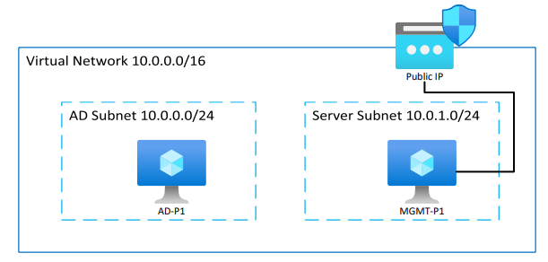

# AZ 801
This repo contains the scripts and deployment files I use to manage the lab environment for the content related to AZ-801:
[AZ-801 YouTube Playlist](https://youtube.com/playlist?list=PLf4LHvX8--d9OHjQOs5Mnk1nNE0BTD488&si=8rz_vlgdxWSazdRV)

## Contents

## Guided Labs
The [Guided Labs](https://github.com/DanZab/az801/tree/main/Guided%20Labs) page is in progress, but contains some walkthroughs you can use as you're studying for the AZ-801 to teach yourself the exam objectives.

### Configuration Scripts
- **Active Directory** contains a script you can use to populate a blank AD domain. It creates OUs, Groups, Users and some default GPOs
- **Failover Clusters** contains a script to configure a server as a host for iSCSI drives and then a second that can be used on your nodes to connect to them
- **Management** contains a script to install a set of RSAT tools on the management server so it can be used to manage other lab elements

### Lab Setup
The [Lab Setup] section contains content you can use to quickly deploy an Active Directory lab environment in your Azure tenant using Terraform. Video walkthroughs about how to deploy the environment can be found here: [Instant Active Directory Lab in Azure: Step-by-Step (Part 2)](https://youtu.be/dlGQxzPiXsk).

This deploys the following environment by default:

